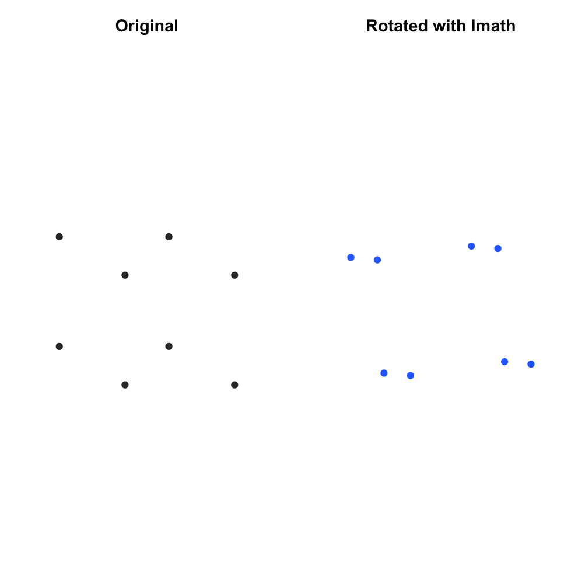

# libimath

<!-- badges: start -->
[](https://github.com/tylermorganwall/libimath/actions/workflows/R-CMD-check.yaml)
<!-- badges: end -->

`libimath` provides Imath headers and static libraries for R packages that
need the computer graphics math types used by OpenEXR and related rendering
software. Imath includes vectors, matrices, bounding boxes, quaternions,
Euler angles, colors, and the `half` 16-bit floating-point type.

The package is primarily intended for package authors. The R functions are
small examples that make it easy to verify the library is available, but the
main purpose of this package is to make Imath available to downstream
packages without requiring users to install Imath manually.

Imath is maintained by the OpenEXR project, a part of the Academy Software
Foundation.

## Installation


``` r
# once released on CRAN
install.packages("libimath")

# development version
remotes::install_github("tylermorganwall/libimath")
```

## Basic R Usage

`libimath` includes a minimal R wrapper around a C++ Imath example. This is
mostly useful as a smoke test and as a reference for package authors.


``` r
library(libimath)

print_imath_version()
#> Imath version 3.2.2

point = c(1, 0, 0)
angles = c(0, pi / 4, 0)

rotated = imath_rotate_point(point, angles)
rbind(original = point, rotated = rotated)
#>                  x y          z
#> original 1.0000000 0  0.0000000
#> rotated  0.7071068 0 -0.7071068
```

The same wrapper can be used to transform many points. This example rotates
the vertices of a cube with Imath and plots a simple 2D projection.


``` r
cube = as.matrix(expand.grid(
  x = c(-1, 1),
  y = c(-1, 1),
  z = c(-1, 1)
))

edges = combn(seq_len(nrow(cube)), 2)
edges = edges[, colSums(abs(cube[edges[1, ], ] - cube[edges[2, ], ])) == 2]

rotate_points = function(points, angles) {
  t(apply(points, 1, function(point) {
    imath_rotate_point(as.numeric(point), angles)
  }))
}

project = function(points) {
  cbind(
    x = points[, 1] - 0.6 * points[, 3],
    y = points[, 2] + 0.35 * points[, 3]
  )
}

rotated_cube = rotate_points(cube, c(pi / 6, pi / 5, pi / 8))

plot_cube = function(points, title, color) {
  projected = project(points)
  plot(
    projected,
    type = "n",
    asp = 1,
    axes = FALSE,
    xlab = "",
    ylab = "",
    main = title,
    xlim = c(-2.2, 2.2),
    ylim = c(-1.8, 1.8)
  )
  for (i in seq_len(ncol(edges))) {
    segment = edges[, i]
    lines(projected[segment, ], col = color, lwd = 2)
  }
  points(projected, pch = 19, col = color)
}

op = par(mfrow = c(1, 2), mar = c(1, 1, 3, 1))
plot_cube(cube, "Original", "#333333")
plot_cube(rotated_cube, "Rotated with Imath", "#2b6eff")
par(op)
```

<div class="figure">

<p class="caption">plot of chunk rotate-cube</p>
</div>

## Using libimath in Another Package

Downstream packages should list `libimath` in `LinkingTo`:

```text
LinkingTo:
    libimath
SystemRequirements: Imath (>= 3.2.0)
```

The package ships a static archive for convenience, but CRAN packages should
first try to use a suitable system library. Your `configure` script should
check the installed Imath version and fall back to the package-provided
static library when the system library is missing or too old.

Kevin Ushey's R-based `configure.R` pattern is a good fit here. It lets you
keep the configure logic in R, use the same logic on Unix and Windows, and
generate `src/Makevars` from `src/Makevars.in`. See the `tools/config.R`
helper used in this package for a complete implementation.

Your top-level configure scripts can be simple wrappers:

```sh
#!/usr/bin/env sh
: "${R_HOME=`R RHOME`}"
"${R_HOME}/bin/Rscript" tools/config.R configure "$@"
```

```sh
#!/usr/bin/env sh
"${R_HOME}/bin${R_ARCH_BIN}/Rscript.exe" tools/config.R configure "$@"
```

### Configure Example

This is a compact `tools/config/configure.R` example. It checks for native
Imath with `pkg-config`, requires a compatible version, and falls back to
the static archive installed by `libimath`.


``` r
options(
  configure.common = FALSE,
  configure.platform = FALSE
)

is_windows = identical(.Platform$OS.type, "windows")
target_arch = Sys.info()[["machine"]]

imath_min_version = "3.2.0"
imath_api = "3_2"

quote_path = function(path) {
  shQuote(
    normalizePath(path, winslash = "/", mustWork = FALSE),
    type = if (is_windows) "cmd" else "sh"
  )
}

flag_path = function(flag, path) {
  paste0(flag, quote_path(path))
}

collapse_flags = function(flags) {
  flags = flags[nzchar(flags)]
  paste(flags, collapse = " ")
}

read_runtime_link_flags = function(path) {
  if (!file.exists(path)) {
    return("")
  }

  flags = unlist(strsplit(
    trimws(paste(readLines(path, warn = FALSE), collapse = " ")),
    "\\s+"
  ))
  collapse_flags(unique(flags))
}

pkgconfig = Sys.which("pkg-config")

pkg_config_module = function(modules, version) {
  if (!nzchar(pkgconfig)) {
    return("")
  }

  for (module in modules) {
    status = system2(
      pkgconfig,
      c("--exists", sprintf("%s >= %s", module, version)),
      stdout = FALSE,
      stderr = FALSE
    )

    if (identical(as.integer(status), 0L)) {
      return(module)
    }
  }

  ""
}

pkg_config_flags = function(args, module) {
  trimws(paste(
    system2(pkgconfig, c(args, module), stdout = TRUE),
    collapse = " "
  ))
}

imath_module = pkg_config_module(c("Imath", "libImath"), imath_min_version)

if (nzchar(imath_module)) {
  message(sprintf("*** configure: using system %s", imath_module))

  IMATH_CPPFLAGS = pkg_config_flags("--cflags", imath_module)
  IMATH_LIBS = pkg_config_flags("--libs", imath_module)
} else {
  message("*** configure: using libimath static library")

  imath_include_root = system.file(
    "include",
    package = "libimath",
    mustWork = TRUE
  )
  imath_include_dir = system.file(
    "include",
    "Imath",
    package = "libimath",
    mustWork = TRUE
  )
  imath_lib_arch = normalizePath(
    file.path(
      system.file("lib", package = "libimath", mustWork = TRUE),
      target_arch
    ),
    winslash = "/",
    mustWork = TRUE
  )

  imath_runtime_flags = read_runtime_link_flags(file.path(
    imath_lib_arch,
    "libimath-runtime-link-flags"
  ))

  IMATH_CPPFLAGS = collapse_flags(c(
    flag_path("-I", imath_include_root),
    flag_path("-I", imath_include_dir)
  ))

  IMATH_LIBS = collapse_flags(c(
    flag_path("-L", imath_lib_arch),
    sprintf("-lImath-%s", imath_api),
    imath_runtime_flags
  ))
}

define(
  IMATH_CPPFLAGS = IMATH_CPPFLAGS,
  IMATH_LIBS = IMATH_LIBS
)

if (is_windows) {
  configure_file("src/Makevars.win.in")
} else {
  configure_file("src/Makevars.in")
}
```

### Makevars

Use the configured values in both `src/Makevars.in` and
`src/Makevars.win.in`:

```make
PKG_CPPFLAGS = @IMATH_CPPFLAGS@
PKG_LIBS = @IMATH_LIBS@ $(SAN_LIBS)

OBJECTS = my_imath_wrapper.o R_init_mypackage.o

$(SHLIB): $(OBJECTS)
```

For the bundled fallback, the library name includes the Imath API suffix:

```make
-L/path/to/libimath/inst/lib/<R_ARCH> -lImath-3_2
```

The package also installs CMake config files. If your package configures a
CMake-based dependency, this R code gives you the Imath CMake config path:


``` r
IMATH_LIB_ARCH = normalizePath(
  file.path(
    system.file("lib", package = "libimath", mustWork = TRUE),
    Sys.info()[["machine"]]
  ),
  winslash = "/",
  mustWork = TRUE
)

IMATH_CMAKE_CONFIG = file.path(IMATH_LIB_ARCH, "cmake", "Imath")
```

### C++ Example

The following `.Call()` example rotates a 3D point using Imath matrix and
vector types.

```cpp
#define R_NO_REMAP

#include <R.h>
#include <Rinternals.h>

#include <Imath/ImathMatrix.h>
#include <Imath/ImathVec.h>

extern "C" SEXP C_rotate_point(SEXP point_sexp, SEXP angles_sexp) {
  if (TYPEOF(point_sexp) != REALSXP || LENGTH(point_sexp) != 3) {
    Rf_error("'point' must be a numeric vector of length 3");
  }
  if (TYPEOF(angles_sexp) != REALSXP || LENGTH(angles_sexp) != 3) {
    Rf_error("'angles' must be a numeric vector of length 3");
  }

  const double *point = REAL(point_sexp);
  const double *angles = REAL(angles_sexp);

  Imath::V3f p(
    static_cast<float>(point[0]),
    static_cast<float>(point[1]),
    static_cast<float>(point[2])
  );
  Imath::V3f rotation(
    static_cast<float>(angles[0]),
    static_cast<float>(angles[1]),
    static_cast<float>(angles[2])
  );

  Imath::M44f transform;
  transform.makeIdentity();
  transform.rotate(rotation);

  Imath::V3f result;
  transform.multVecMatrix(p, result);

  SEXP out = PROTECT(Rf_allocVector(REALSXP, 3));
  REAL(out)[0] = result.x;
  REAL(out)[1] = result.y;
  REAL(out)[2] = result.z;

  UNPROTECT(1);
  return out;
}
```
